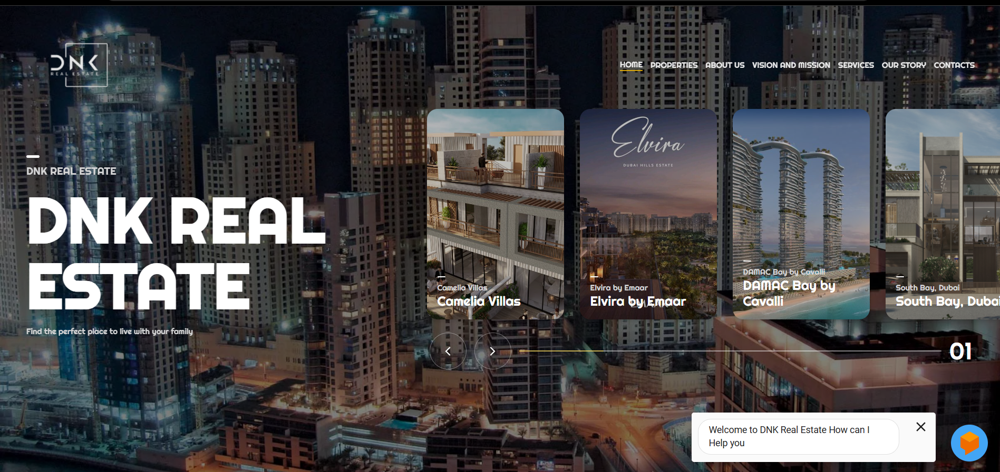
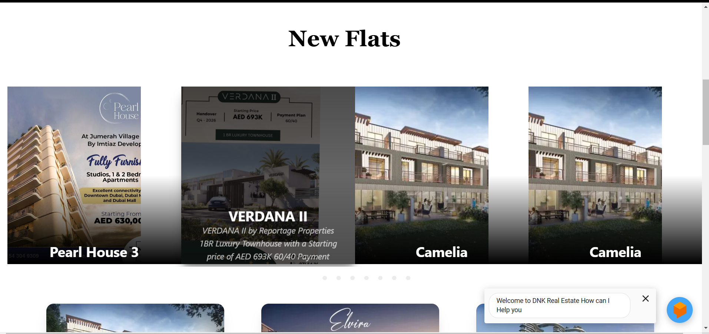
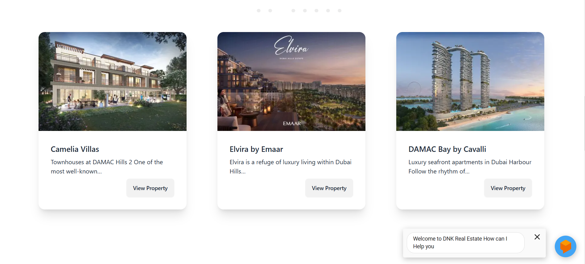
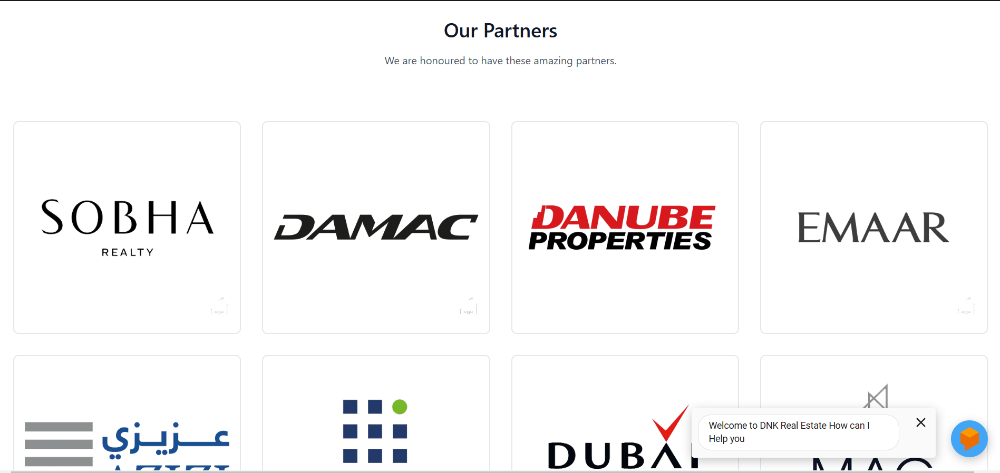

# Getting Started

# Project Overview 

The DNK project combines Next.js, Tailwind CSS, and a chatbot to deliver an interactive web experience. The chatbot is designed to handle common inquiries and guide users, improving engagement and providing instant support. Tailwind CSS enhances the interface with a responsive and modern design.

Key Objectives
Deliver an intuitive, user-friendly interface using Tailwind CSS.
Offer interactive and automated support through a chatbot.
Ensure performance optimization and scalability with Next.js.
Technologies Used
Next.js: A React-based framework for server-side rendering and static site generation.
Tailwind CSS: A utility-first CSS framework for fast, responsive UI design.
Chatbot Integration: Can be powered by an AI API (e.g., OpenAI) or a custom chatbot service.

!

## Prerequisites
- Node.js and yarn/bun installed
- NextJS
- Tailwind CSS
- Chatbot

## Setup
1.	Clone the Repository:
git clone https://github.com/Ariba-memon/websitereal/tree/master
2.	Install Dependencies: npm install
3.	Run the Development Server:
4.	View the Application:
Open http://localhost:3000 in your browser to see the application in action.

🔧 Commands
•	Development: npm run dev
🛠️ Technology Stack
•	Next.js for server-side rendering
•	TypeScript for type safety and improved tooling
•	Tailwind CSS for responsive and efficient styling

